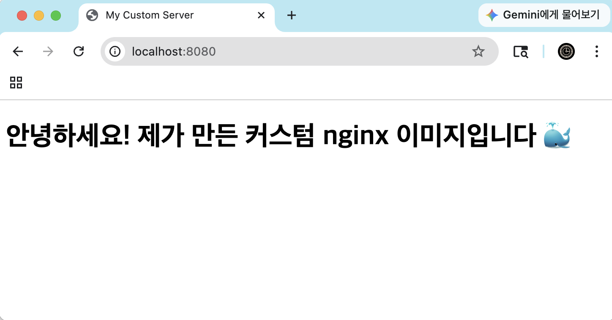
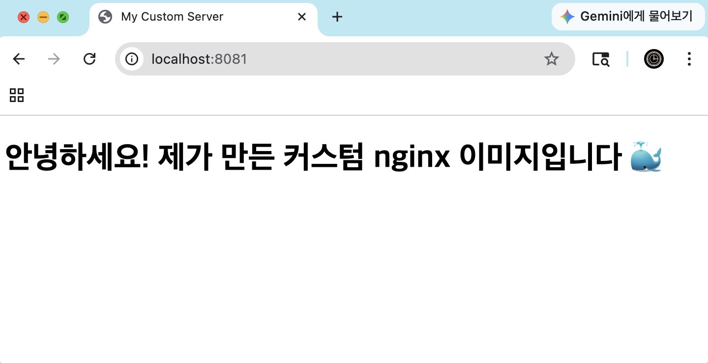
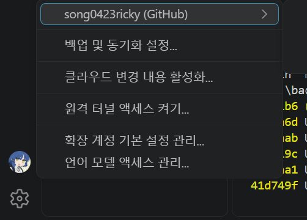

# 개발 워크스테이션 구축 미션

## 1) 프로젝트 개요

워크스테이션 구축 미션으로, 터미널(리눅스 CLI), Docker(OrbStack), Git/GitHub을 직접 손으로 다뤄보며 재현 가능한 개발 환경을 세팅하는 것을 목표로 함  
터미널 기초 조작과 파일 권한 실습 → Docker 설치 및 컨테이너 운영 → 커스텀 Dockerfile로 웹서버 컨테이너화 → 포트 매핑/바인드 마운트/볼륨 실습 → Git/GitHub 연동 순으로 진행했음

## 2) 실행 환경

- OS: macOS
- Shell: zsh
- 컨테이너 엔진: OrbStack (Docker Desktop 대체, 서울캠퍼스 sudo 권한 제한 대응)
- Docker: 28.5.2 (build ecc6942)
- Git: 2.53.0

## 3) 수행 체크리스트

- [o] 터미널 기본 조작 및 폴더 구성 (절대/상대 경로, 생성/복사/이동/삭제)
- [o] 파일/디렉토리 권한 변경 실습 (644 → 755, 755 → 700)
- [o] Docker 설치/점검 (`docker --version`, `docker info`)
- [o] hello-world 실행
- [o] ubuntu 컨테이너 진입 실습
- [o] 컨테이너 종료(exit) vs 유지(exec) 차이 관찰
- [o] 커스텀 Dockerfile 빌드/실행 (nginx:alpine 베이스)
- [o] 포트 매핑 접속 (2회: 8080, 8081)
- [o] 바인드 마운트 반영 확인
- [o] Docker 볼륨 영속성 검증
- [o] Git 설정 + GitHub 연동 (add/commit/pull/push)

---

## 4) 터미널 기초 실습

### 4-1. 절대 경로 / 상대 경로

```bash
$ pwd
/Users/song0423ricky4374/Codyssey_Mission1/practice
# 과제목표1 [절대 경로: / 부터 시작하는 루트부터 해당 파일까지의 완전한 주소]

$ cd ..
# (상대 경로로 한 단계 위로 이동)

$ cd practice
# 과제목표1 [상대 경로: 현재 파일의 위치를 기준으로 연결하려는 파일의 상대적인 경로]
```
<과제목표1>  
절대 경로: / 부터 시작하는 루트부터 해당 파일까지의 완전한 주소  
상대 경로: 현재 파일의 위치를 기준으로 연결하려는 파일의 상대적인 경로  
예시는 위의 터미널 로그로 표현  
  
<명령어 정리>  
pwd  
Print Working Directory의 약자, 현재 폴더를 절대 경로로 화면에 출력     

cd  
Change Directory의 약자,뒤에 이동할 경로를 붙여서 사용

### 4-2. 파일/폴더 기본 조작

```bash
$ ls -la
total 0
drwxr-xr-x  2 song0423ricky4374  song0423ricky4374   64  7 30 17:16 .
drwxr-xr-x  5 song0423ricky4374  song0423ricky4374  160  7 30 17:16 ..

# 빈 파일 생성
$ touch memo.txt

# 파일에 내용 작성
$ echo "hello" > memo.txt

# 파일 내용 확인
$ cat memo.txt
hello

# 복사
$ cp memo.txt memo_copy.txt
$ ls -la
(memo.txt, memo_copy.txt 둘 다 존재 확인)

# 이름 변경/이동
$ mv memo_copy.txt memo_renamed.txt

# 삭제
$ rm memo_renamed.txt
$ ls -la
total 8
drwxr-xr-x  3 song0423ricky4374  song0423ricky4374   96  7 30 17:40 .
drwxr-xr-x  5 song0423ricky4374  song0423ricky4374  160  7 30 17:16 ..
-rw-r--r--  1 song0423ricky4374  song0423ricky4374    6  7 30 17:36 memo.txt
(memo.txt만 남음 확인)
```
<명령어 정리>  
ls -la  
ls = list,현재 폴더 안의 파일/폴더 목록을 보여줌  
-l = long format, 옵션. 권한, 소유자, 크기, 수정일 등 상세 정보를 함께 보여줌  
-a = all의 약자, .으로 시작하는 숨김 파일까지 포함해서 전부 보여줌    
  
touch    
파일이 없으면 빈 파일을 새로 생성하고, 이미 있으면 파일의 "마지막 수정 시각"만 현재 시각으로 갱신함, 내용은 건드리지 않음  
  
echo  
뒤에 오는 문자열을 화면(표준 출력)에 그대로 출력함  
'>' 기호와 함께 쓰면 화면 대신 파일에 그 내용을 씀 (echo "내용" > 파일명)

cat  
concatenate,파일을 하나만 지정하면 그 파일의 전체 내용을 화면에 출력
  
cp '원본파일' '복사본이름'  
copy,원본은 그대로 두고, 지정한 이름으로 동일한 내용의 새 파일을 만듦  

mv '원본이름' '새이름'  
move, 파일을 다른 위치로 옮기기, 같은 위치에서 이름만 바꿀떄 사용 

### 4-3. 파일 권한 실습 (r/w/x, 644 → 755)

```bash
$ ls -l memo.txt
-rw-r--r--  1 song0423ricky4374  song0423ricky4374  6  7 30 17:36 memo.txt
# (변경 전, 644 = 소유자 rw- / 그룹 r-- / 기타 r--)

$ chmod 755 memo.txt
$ ls -l memo.txt
-rwxr-xr-x  1 song0423ricky4374  song0423ricky4374  6  7 30 17:36 memo.txt
# (변경 후, 755 = 소유자 rwx / 그룹 r-x / 기타 r-x)
```
<과제목표2>  
리눅스 파일 권한은 10자리로 표현함  
1__ /2 _ _ _ /3 _ _ _ /4 _ _ _    
  
1:파일의 종류  - txt등의 일반파일이면 -,파일이면 d등으로 표기  

다음부터는 이용자의 권한을 나타냄  

2:소유자 권한  - 그 파일/폴더를 만들거나 소유권을 넘겨받은 자의 권한  
3:그룹 권한    - 사용자들을 묶은 집단의 권한 (사용자가 한명이면 소유자와 동일하게 나타남)  
4:기타 권한    - 소유자와 그룹을 제외한 사용자의 권한  

이떄 권한을 나타내는 r(읽기) w(쓰기) x(실행)의 의미는 다음과 같음  
  
r: read    파일 내용을 볼 수 있음         / 숫자 4로 나타냄  
w: write   파일 내용을 수정/삭제할 수 있음 / 숫자 2로 나타냄  
x: execute 파일을 실행할 수 있음          / 숫자 1로 나타냄  
  
따라서 이 권한을 2,3,4 번자리 권한의 각각의 합으로 표현할수도 있음  
예를들면 -rw-r--r-- 의 경우 -/-rw/r--/r-- 이며 파일 종류는 rwx방식이 아님으로 표현하지 않음으로 이루 권한을 표기하면   
-rw -> 042 = 6 / r-- -> 400 = 4 임으로 644로 표현할수 있음    
이때 chmod로 권한을 수정해서 644-> 755가 되는것은 각 이용자의 권한에 1에해당하는 x(실행권한)을 추가한것을 의미함  

추가적으로 1,2,4로 권한을 나타내는 이유는 각 자리에 비트가 꺼지고 켜지는것을 3자리로 나타낸 8진수 표기법이기 떄문  
x -> 2⁰, w -> 2¹ , r->2²  
  
<명령어 정리>    
chmod '숫자' '파일명'   
change mode(mode = 파일의 권한 상태),파일/폴더의 권한을 바꾸는 명령어이며 숫자는 권한 합을 나타냄  
  
### 4-4. 디렉토리 권한 실습 (755 → 700)

```bash
$ mkdir test_dir
$ ls -ld test_dir
drwxr-xr-x  2 song0423ricky4374  song0423ricky4374  64  7 30 17:49 test_dir
# (변경 전, 755)

$ chmod 700 test_dir
$ ls -ld test_dir
drwx------  2 song0423ricky4374  song0423ricky4374  64  7 30 17:49 test_dir
# (변경 후, 700 = 소유자만 접근 가능)
```
<명령어 정리>    
mkdir  '폴더이름'
make directory,지정한 이름으로 새 폴더를 생성함

ls -ld  
-d = directory의 약자. 폴더 지정 시, "그 폴더 자체"의 정보,권한 등을 한 줄로 보여줌,   
-d 없이 ls -l 폴더명을 하면 폴더 안의 파일 목록이 나오지만, -d를 붙이면 폴더 자체의 정보만 나옴  


## 5) Docker(OrbStack) 설치 및 점검

```bash
# Docker CLI 버전 확인
$ docker --version
Docker version 28.5.2, build ecc6942

# Docker 데몬(OrbStack 엔진) 동작 확인
$ docker info
Client:
 Context:    orbstack
Server:
 Server Version: 28.5.2
 Containers: 0
 Images: 0
 Operating System: OrbStack
 ...
```
`Context: orbstack`, `Operating System: OrbStack`을 통해 OrbStack 엔진으로 Docker CLI가 정상 연결되어 있음을 확인했다.

<개념 정리>  
Doeker : 리눅스 컨테이너를 기반으로 만든 os레벨 가상화 구현을 도와주는 프로그램,VM(가상머신)과 다르게 호스트의 OS커널을 사용하지만 더 가벼움  
이미지 : 소스 코드, 라이브러리, 종속성, 도구 및 응용 프로그램을 실행하는데 필요한 기타 파일을 포함하는 불변(변경 불가) 파일임  
컨테이너: 컨테이너는 이미지를 실행한 인스턴스 (가상컴퓨터), (인스턴스는 이미지를 기반으로 만들려는 객체를 실체화시킨것)  
데몬   : 백그라운드에서 계속 실행되면서 도커 클라이언트와 상호 작용하고 도커 이미지와 컨테이너를 관리,처리해주는 프로그램  
CLI    : Command Line Interface,문자를 입력하여 컴퓨터에 명령을 내리는 인터페이스 방식으로 cmd(명령 프롬포트),terminal등이 CLI임  
  
<명령어 정리>    
$ docker --version
docker '명령어' = Docker CLI를 실행하는 기본 명령어.   
--version = 두 개의 하이픈(--)으로 시작하는 long option 형식, 지금 설치된 Docker CLI의 버전 정보를 출력하라는 옵션   
  
$ docker info.   
info = information, 현재 연결된 Docker 엔진(OrbStack)의 전반적인 상태 정보(컨텍스트, 컨테이너/이미지 개수, OS 종류 등)를 자세히 출력함   

---

## 6) 컨테이너 실행 실습

### 6-1. 기본 명령 확인

```bash
$ docker images          # 다운로드된 이미지 목록 확인
REPOSITORY    TAG       IMAGE ID       CREATED        SIZE
ubuntu        latest    de7345b16e94   2 weeks ago    100MB
hello-world   latest    e2ac70e7319a   4 months ago   10.1kB

$ docker ps               # 실행 중인 컨테이너 목록 확인
CONTAINER ID   IMAGE     COMMAND   CREATED   STATUS    PORTS     NAMES
(실행 중인 컨테이너 없음)

$ docker ps -a             # 멈춘 것 포함 전체 컨테이너 목록 확인
CONTAINER ID   IMAGE         COMMAND    CREATED         STATUS                     PORTS     NAMES
104f2e839d87   ubuntu        "bash"     8 minutes ago   Exited (0) 5 minutes ago             my-ubuntu
4367b013568c   hello-world   "/hello"   9 minutes ago   Exited (0) 9 minutes ago             naughty_williamson
```
<명령어 정리>    
docker images. (최종결과물:Docker 운영/검증 로그).  
지금까지 로컬 컴퓨터에 다운로드(pull)되어 저장된 이미지 목록을 전부 보여줌.  
  
docker ps.   
process status,현재 실행 중인 컨테이너 목록만 보여줌. 
  
docker ps -a. (최종결과물:Docker 운영/검증 로그). 
-a = all,실행 중인 것뿐 아니라, 멈춘(Exited) 컨테이너까지 포함한 전체 컨테이너 목록을 보여줌. 
  
### 6-2. hello-world 실행

```bash
$ docker run hello-world
Unable to find image 'hello-world:latest' locally
latest: Pulling from library/hello-world
Status: Downloaded newer image for hello-world:latest
Hello from Docker!
This message shows that your installation appears to be working correctly.
```
<명령어 정리>    
docker run hello-world.  
run = 이미지를 기반으로 새 컨테이너를 만들고 즉시 시작함  
hello-world = Docker Hub(공용 이미지 저장소)에 있는 실행할 테스트용 공식 이미지 이름, 로컬에 이미지가 없으면 자동으로 Docker Hub에서 다운로드(pull)한 뒤 실행함  
  
### 6-3. ubuntu 컨테이너 진입 실습

```bash
$ docker run -it --name my-ubuntu-v2 ubuntu bash

$ root@f19eafa3998d:/# ls
bin  boot  dev  etc  home  lib  lib64  media  mnt  opt  proc  root  run  sbin  srv  sys  tmp  usr  var

$ root@f19eafa3998d:/# pwd
/

$ root@f19eafa3998d:/# echo "hello from container"
hello from container

$ root@f19eafa3998d:/# exit - ***** my-ubuntu-v2 exit 함
```
<명령어 정리>    
docker run -it --name my-ubuntu-v2 ubuntu bash  
-i = interactive,컨테이너의 표준 입력을 열어둬서, 사용자가 명령어를 입력할 수 있게 함  
-t = teletypewriter(가상 터미널), 터미널 화면처럼 출력이 표시되도록 함  
-it = -i와 -t를 합쳐 쓴 것,두 개를 함께 써야 실제로 터미널처럼 상호작용 가능한 컨테이너 접속이 됨  
--name my-ubuntu-v2 = 컨테이너에 my-ubuntu-v2라는 별칭(이름)을 붙이는 옵션. 안 붙이면 Docker가 랜덤한 이름을 자동 생성함  
ubuntu = 사용할 이미지 이름 (우분투 리눅스 배포판의 공식 이미지,os)  
bash = 컨테이너 안에서 실행할 명령어. bash는 리눅스의 대표적인 셸(shell) 프로그램 이름으로, 이걸 실행하면 컨테이너 내부에서 명령어를 입력할 수 있는 상태가 됨  

### 6-4. 로그 / 리소스 확인

```bash
$ docker ps -a
CONTAINER ID   IMAGE         COMMAND    CREATED          STATUS                      PORTS     NAMES
f19eafa3998d   ubuntu        "bash"     4 minutes ago    Exited (0) 4 minutes ago              my-ubuntu-v2             *****my-ubuntu-v2 exit한 결과  STATUS->Exited 됨
4367b013568c   hello-world   "/hello"   22 minutes ago   Exited (0) 22 minutes ago             naughty_williamson

$ docker logs my-ubuntu-v2
root@f19eafa3998d:/# ls
bin  boot  dev  etc  home  lib  lib64  media  mnt  opt  proc  root  run  sbin  srv  sys  tmp  usr  var
root@f19eafa3998d:/# pwd
/
root@f19eafa3998d:/# echo "hello from container"
hello from container
root@f19eafa3998d:/# exit

$ docker stats --no-stream
CONTAINER ID   NAME      CPU %     MEM USAGE / LIMIT   MEM %     NET I/O   BLOCK I/O   PIDS
(실행 중인 컨테이너가 없어 표시할 내용 없음)
```
<명령어 정리>.     
docker logs my-ubuntu-v2  (최종결과물4:Docker 운영/검증 로그).     
logs = 컨테이너가 표준 출력(터미널 화면)에 남긴 기록을 다시 보여주는 하위 명령어.       
my-ubuntu-v2 = 로그를 확인할 대상 컨테이너의 이름,컨테이너가 정지된 상태여도, 살아있을 때 남긴 출력 기록은 그대로 조회 가능함.     
  
docker stats --no-stream (최종결과물:Docker 운영/검증 로그).   
stats = statistics, 실행 중인 컨테이너들의 CPU, 메모리, 네트워크, 디스크 사용량을 보여주는 하위 명령어, 옵션 없이 쓰면 실시간으로 계속 갱신되며 화면에 출력됨.     
--no-stream = "스트림(연속 갱신)을 하지 않는다"는 옵션, 현재 시점의 값을 딱 한 번만 출력하고 끝냄.       
  
### 6-5. exec vs attach 차이 관찰

```bash
# 백그라운드로 계속 살아있게 실행 (메인 프로세스: sleep infinity)
$ docker run -d --name keep-alive ubuntu sleep infinity

$ docker ps
CONTAINER ID   IMAGE     COMMAND            CREATED          STATUS          PORTS     NAMES
2ff82e583cde   ubuntu    "sleep infinity"   12 seconds ago   Up 11 seconds             keep-alive

# 실행 중인 컨테이너에 추가 세션으로 진입
$ docker exec -it keep-alive bash
root@2ff82e583cde:/# echo "still running"
still running
root@2ff82e583cde:/# exit

# exit 했음에도 keep-alive는 여전히 Up 상태
$ docker ps
CONTAINER ID   IMAGE     COMMAND            CREATED              STATUS              PORTS     NAMES
2ff82e583cde   ubuntu    "sleep infinity"   About a minute ago   Up About a minute             keep-alive
``` 

이어서 `docker attach`도 직접 실행    
  
```bash
# 백그라운드로 실행하되, bash가 메인 프로세스로 대기하도록 -dit 옵션 사용
$ docker run -dit --name attach-bash-test ubuntu bash
Unable to find image 'ubuntu:latest' locally
latest: Pulling from library/ubuntu
Status: Downloaded newer image for ubuntu:latest
1585ac682f1ce4e2859a74d2b230246593d3de6fa913ed523266851cf2ffc687

# 메인 프로세스(bash)에 직접 접속
$ docker attach attach-bash-test
root@1585ac682f1c:/# echo "attach with bash test"
attach with bash test
root@1585ac682f1c:/# exit
exit

# 컨테이너 상태 확인
$ docker ps -a
CONTAINER ID   IMAGE     COMMAND   CREATED          STATUS                      PORTS     NAMES
1585ac682f1c   ubuntu    "bash"    48 seconds ago   Exited (0) 11 seconds ago             attach-bash-test
```
   
<개념정리>  
my-ubuntu-v2에서는 메인 프로세스(bash)를 직접 실행했기 때문에 exit 시 컨테이너가 함께 Exited 상태가 됨  
반면 keep-alive는 메인 프로세스가 sleep infinity이고 exec는 그 위에 추가로 연 세션이었으므로, 그 세션에서 exit해도 메인 프로세스는 살아있어 컨테이너가 계속 `Up` 상태를 유지함 
[세션은 컨테이너 안에서 실행된 하나의 부가적인 프로세스(터미널 연결)]
attach는 메인 프로세스 자체에 직접 연결되는 방식이라, 그 프로세스가 sleep infinity처럼 입력을 받지 않는 종류이면 아무런 반응이 없고,    
메인 프로세스가 bash일떄 (`attach-bash-test`)에서는 `attach`로 접속하자 정상적인 대화형 셸로 동작해 `echo` 명령에 즉시 응답했고, `exit`를 입력하자   
그 bash 프로세스(=메인 프로세스)가 실제로 종료되면서 컨테이너 전체가 `Exited (0)` 상태로 정지되었다.   
이는 exec로 연 별도 세션에서는는 exit해도 컨테이너가 유지되는 것과는 다른 방식의 유지라는 점에서 대조됨   

<명령어 정리>    
docker run -d --name keep-alive ubuntu sleep infinity  
-d = detached, keep-alive 컨테이너를 백그라운드에서 실행시키고, 터미널 제어권은 바로 사용자에게 돌려줌 (터미널이 컨테이너에 붙잡히지 않음)  
sleep infinity = 컨테이너 안에서 실행할 명령어. sleep = 리눅스의 "일정 시간 동안 아무것도 안 하고 대기하는" 명령어, infinity = 영구히  
-> 컨테이너가 영원히 살아있게 만드는 용도로 흔히 쓰임  
  
docker run -dit --name attach-bash-test ubuntu bash. 
-d = detached	백그라운드에서 실행. 터미널이 컨테이너에 붙잡히지 않고 바로 명령 프롬프트로 돌아옴. 
-i = interactive	표준 입력(키보드 입력)을 열어둠. 나중에 이 컨테이너에 뭔가 입력할 수 있게 준비해둠. 
-t = tty (가상 터미널)	터미널 화면처럼 동작하도록 준비함 (프롬프트, 커서 등이 정상적으로 보이게). 

--name attach-bash-test. 
이 컨테이너에 attach-bash-test라는 이름을 붙이는 옵션 (앞서 여러 번 설명드린 것과 동일). 

docker attach attach-bash-test
attach = 앞서 설명드린 것과 동일한 하위 명령어. 이미 실행 중인 컨테이너의 메인 프로세스에 터미널을 연결
attach-bash-test = 접속할 대상 컨테이너의 이름

이번엔 대상 프로세스가 bash였기 때문에, 접속하자마자 root@1585ac682f1c:/#라는 진짜 프롬프트가 뜨고, 정상적으로 명령어에 반응했어요. (지난번 sleep infinity였을 때와 달리요.)

docker exec -it keep-alive bash
exec = execute,이미 실행 중인 컨테이너 안에 추가로 새 명령어(세션)를 실행하는 하위 명령어 (run과 달리 새 컨테이너를 만들지 않음)  
-it = 위와 동일 (상호작용 + 터미널)  
keep-alive = 대상이 되는, 이미 실행 중인 컨테이너의 이름  
bash = 그 컨테이너 안에서 실행할 셸 프로그램    

---

## 7) 커스텀 Dockerfile 기반 웹서버

- 선택한 방식: (A) 웹서버 베이스 이미지 활용 — `nginx:alpine` + 정적 콘텐츠 교체

### 7-1. 파일 구성

```bash
$ mkdir -p webserver/site

# index.html 생성 (한글 깨짐 방지를 위해 charset UTF-8 메타태그 포함)
$ cat > site/index.html << 'EOF'
<!DOCTYPE html>
<html>
<head>
  <meta charset="UTF-8">
  <title>My Custom Server</title>
</head>
<body>
  <h1>안녕하세요! 제가 만든 커스텀 nginx 이미지입니다 🐳</h1>
</body>
</html>
EOF

# Dockerfile 생성
$ cat > Dockerfile << 'EOF'
# nginx:alpine을 베이스 이미지로 사용 (가볍고 빠른 웹서버)
FROM nginx:alpine
# 이미지에 이름표(메타데이터) 붙이기
LABEL org.opencontainers.image.title="my-custom-nginx"
# 개발 환경임을 나타내는 환경변수 설정
ENV APP_ENV=dev
# 내가 만든 site 폴더의 정적 페이지로 nginx 기본 페이지를 교체
COPY site/ /usr/share/nginx/html/
EOF
```
*(A) 웹 서버 베이스 이미지 활용(예: NGINX/Apache 등) + 정적 콘텐츠/설정만 교체

<개념 정리>  
nginx  
웹 서버 / 리버스 프록시 / 로드 밸런서로 널리 쓰이는 오픈소스 소프트웨어  
정적 파일 서빙, API 요청 프록시, 여러 서버 앞단에서 트래픽 분산 등에 사용됨  

alpine  
Docker 이미지의 "태그(tag)"로, 베이스 OS가 Alpine Linux라는 뜻  
Alpine Linux는 용량이 매우 작은 경량 리눅스 배포판 (약 5MB 수준)  
일반 nginx:latest (Debian/Ubuntu 기반, 100MB+)에 비해 이미지 크기가 훨씬 작음 (nginx:alpine은 보통 40MB 이하)  

<명령어 정리>    
cat > site/index.html << 'EOF' ... EOF (최종결과물5:Dockerfile 기반 웹 서버 컨테이너)  
cat = 위에서 설명한 것과 동일하지만 여기서는 파일을 "읽는" 게 아니라 표준 입력을 그대로 받아서 출력하는 용도로 씀   
'>' = 리다이렉션기호, 원래는 화면에 나갈 출력을, 화면 대신 지정한 파일로 보내라는 뜻. 파일이 없으면 새로 만들고, 있으면 기존 내용을 덮어씀  
site/index.html = 출력을 저장할 대상 파일 경로  
<< = 히어독(heredoc) 시작 기호, 여기부터 특정 표시가 나올 때까지의 여러 줄 전체를 입력으로 사용하겠다는 뜻  
'EOF' = End Of File,히어독의 "끝을 표시하는 이름표"로 관습적으로 쓰는 단어일 뿐, 특별한 의미가 있는 예약어는 아님 (다른 단어로 바꿔도 동작함),작은따옴표로 감싸면 그 안의 내용에 변수 치환 등이 일어나지 않고 그대로 입력됨  
마지막 줄의 단독 EOF = 히어독의 끝을 알리는 표시. 이 줄이 나오기 전까지 입력한 모든 줄이 파일에 그대로 저장됨  
   
['html' 정리]  
    
```` <!DOCTYPE html> ````
HTML 문서의 종류(버전)를 브라우저에게 알려주는 선언. "이 문서는 HTML5 표준을 따른다"는 의미. 
  
```` <meta charset="UTF-8"> ] ````
meta = 문서 자체에 대한 부가 정보(메타데이터)를 담는 태그. 
charset = character set(문자 집합)의 약자. 이 문서가 어떤 방식으로 글자를 인코딩했는지 지정.   
UTF-8 = 한글을 포함한 전 세계 문자를 표현할 수 있는 표준 인코딩 방식 이름. 이걸 명시해야 브라우저가 한글을 올바르게 해석함.   
  
cat > Dockerfile << 'EOF' ... EOF.    
위 index.html과 완전히 동일한 원리로, 이번엔 Dockerfile이라는 이름의 파일에 내용을 저장함.   
    
FROM nginx:alpine.   
FROM = Dockerfile 전용 명령어,이 이미지를 만들 때 기반으로 삼을 베이스 이미지를 지정.   
nginx = 사용할 이미지 이름 (웹서버 소프트웨어 nginx의 공식 이미지).   
:alpine = 태그(tag). 콜론(:) 뒤에 붙어 이미지의 특정 버전/종류를 지정. alpine은 매우 가벼운 리눅스 배포판을 기반으로 만든 버전이라는 뜻.   
  
LABEL org.opencontainers.image.title="my-custom-nginx".   
LABEL = Dockerfile 전용 명령어. 이미지에 이름-값 형태의 메타데이터(꼬리표)를 추가함.   
org.opencontainers.image.title = 라벨의 키(key) 이름. OCI(Open Container Initiative)라는 표준 단체가 정한 "이미지 제목"을 나타내는 규칙적인 키 이름.   
"my-custom-nginx" = 그 키에 대응하는 값. 여기서는 이미지의 제목으로 지정한 문자열.   
  
ENV APP_ENV=dev. 
ENV = environment,Dockerfile 전용 명령어,컨테이너 실행 시 적용될 환경변수를 설정. 
APP_ENV = 환경변수의 이름 (임의로 지정 가능한 이름). 
dev = 그 변수에 담을 값. 여기서는 "development"의 줄임말로 사용.   
  
COPY site/ /usr/share/nginx/html/.   
COPY = Dockerfile 전용 명령어. 빌드 시점에 호스트의 파일/폴더를 이미지 내부로 복사함.   
site/ = 복사할 원본 경로 (호스트의 site 폴더, 끝의 /는 "폴더 안의 내용물 전부"를 의미).   
/usr/share/nginx/html/ = 복사될 대상 경로 (컨테이너 내부에서 nginx가 웹페이지 파일을 찾는 표준 위치).   
  
<적용한 베이스>  
- 베이스: `nginx:alpine` (경량 웹서버 이미지)

<적용한 커스텀 포인트 각각의 목적>   
- `LABEL`: 이미지 메타데이터(제목) 부여  
- `ENV APP_ENV=dev`: 개발 환경 구분용 환경변수  
- `COPY site/ ...`: 직접 작성한 정적 페이지로 nginx 기본 페이지 교체  

### 7-2. 빌드

```bash
$ docker build -t my-web:1.0 .
[+] Building 6.4s (7/7) FINISHED
 => [1/2] FROM docker.io/library/nginx:alpine ...
 => [2/2] COPY site/ /usr/share/nginx/html/
 => exporting to image
 => => naming to docker.io/library/my-web:1.0

$ docker images
REPOSITORY    TAG       IMAGE ID       CREATED         SIZE
my-web        1.0       d9f3fde493d6   5 minutes ago   62.4MB
```
<과제목표3>  
"기존 Dockerfile을 기반으로 “커스텀 이미지”를 만들 수 있다" 완료  

<명령어 정리>   
docker build -t my-web:1.0 .  
build = docker의 하위 명령어. Dockerfile을 읽어서 실제 이미지를 만들어내는(빌드하는) 명령. 
-t = tag의 약자. 만들어질 이미지에 이름표를 붙이는 옵션. 
my-web:1.0 = 붙일 이름표. my-web은 이미지 이름(repository), :1.0은 태그(버전 구분용). 
. = 빌드 컨텍스트(context) 경로. "지금 있는 이 폴더를 기준으로 Dockerfile을 찾고, 필요한 파일들(예: site 폴더)도 이 폴더 기준으로 찾아라"는 의미

docker images. 
방금 만든 my-web:1.0이 목록에 잘 생겼는지 확인하는 용도로 재사용. 


### 7-3. 포트 매핑 접속 (2회)

```bash
# 1차: 8080 포트
$ docker run -d -p 8080:80 --name my-web-8080 my-web:1.0 (포트 매핑 접속 증거)
$ curl http://localhost:8080
(한글 정상 출력 확인)

# 2차: 8081 포트 (같은 이미지로 독립된 컨테이너 하나 더 실행)
$ docker run -d -p 8081:80 --name my-web-8081 my-web:1.0
$ curl http://localhost:8081
(한글 정상 출력 확인)
```
[8080 포트]


[8081 포트]

동일한 이미지(`my-web:1.0`)로 서로 다른 포트에 독립된 컨테이너 두 개를 동시에 실행할 수 있음을 확인했다.  

<용어정리>
컨테이너는 호스트(내 컴퓨터)와 네트워크가 격리되어 있음으로  컨테이너 안에서 nginx가 80번 포트로 서비스를 열어도 컨테이너만의 독립된 네트워크 공간 안에서만 열려있고
호스트에서는 그 포트가 안 보임. 따라서 브라우저나 curl로 localhost:80을 쳐도 컨테이너 내부에는 절대 닿지 않음.
이 격리된 두 네트워크 사이를 연결해주는 통로가 바로 포트 매핑임.

<과제목표3>  
"기존 Dockerfile을 기반으로 “커스텀 이미지”를 만들 수 있다" 완료  

<과제목표4-포트매핑이 필요한 이유>  
컨테이너는 호스트와 네트워크가 격리되어 있어서 포트 매핑(-p 호스트포트:컨테이너포트)이라는 명시적인 통로를 만들어주지 않으면 외부(브라우저, curl 등)에서 컨테이너 내부의
서비스에 절대 접근할 수 없기 때문에 포트 매핑이 필요함  
  
<명령어 정리>   
docker run -d -p 8080:80 --name my-web-8080 my-web:1.0. 
-p = publish, 호스트와 컨테이너 사이의 포트를 연결(매핑)하는 옵션. 
8080:80 = 호스트포트:컨테이너포트 형식, 콜론(:) 왼쪽(8080)은 내 컴퓨터(맥)에서 사용할 포트, 오른쪽(80)은 컨테이너 내부에서 nginx가 듣고 있는 포트. 
my-web:1.0 = 실행할 이미지 이름:태그. 

curl http://localhost:8080. 
curl = Client URL,터미널에서 웹/네트워크 요청을 보내고 응답을 받아오는 프로그램. 
http:// = 사용할 통신 프로토콜(규약) 지정. 웹페이지를 주고받을 때 쓰는 표준 규약. 
localhost = "지금 이 컴퓨터 자신"을 가리키는 특별한 호스트 이름 (자기 자신에게 접속한다는 뜻). 
:8080 = 접속할 포트 번호. 콜론 뒤에 붙여서 지정. 

docker run -d -p 8081:80 --name my-web-8081 my-web:1.0. 
위와 완전히 동일한 구조. 호스트 포트만 8081로 바꿔서, 같은 이미지로 두 번째 독립된 컨테이너를 실행. 
  
curl http://localhost:8081. 
위와 동일한 방식으로, 이번엔 8081번 포트에 접속해 확인. 
  
---

## 8) 바인드 마운트 실습 (변경 반영 확인)

```bash
# 맥의 site 폴더를 컨테이너의 nginx html 폴더와 실시간 연결
$ docker run -d -p 8082:80 --name my-web-bind -v $(pwd)/site:/usr/share/nginx/html my-web:1.0

$ curl http://localhost:8082
# (변경 전)
<h1>안녕하세요! 제가 만든 커스텀 nginx 이미지입니다 🐳</h1>

# --- 맥에서 site/index.html 내용 수정 ---

$ curl http://localhost:8082
# (변경 후 - 재빌드/재시작 없이 즉시 반영됨)
<h1>수정된 페이지입니다! 바인드 마운트가 잘 동작하네요 🎉</h1>
```
[변경전]


---------------------------------------------------------------------------------------------------------------------------------------------------------------------------------------------

[변경후]


<개념정리>  
바인드 마운트는 호스트(내 컴퓨터)의 특정 경로에 있는 실제 파일/폴더를, 컨테이너 내부의 특정 경로에 그대로 연결(마운트)하는 방식임. 
컨테이너 입장에서는  파일들이 원래 자기 안에 있었던 것처럼 접근하지만, 실제로는 호스트의 파일을 실시간으로 그대로 참조함.

바인드 마운트는 호스트 시스템의 어느 곳에나 저장할 수 있고, non-Docker 프로세스나 도커 컨테이너 내에서 언제든지 수정이 가능함   
바인드 마운트를 사용하면 호스트 시스템의 파일 또는 디렉터리가 컨테이너에 마운트되며, 파일 또는 디렉토리는 호스트의 전체 경로로 지정됨  
즉, 컨테이너가 살아있는상태로 수정및편집이 가능해짐  
  
<명령어 정리>   
docker run -d -p 8082:80 --name my-web-bind -v $(pwd)/site:/usr/share/nginx/html my-web:1.0.    
-v = volume, 호스트와 컨테이너 사이에 폴더/파일을 연결(마운트)하는 옵션 (바인드 마운트와 볼륨 둘 다 이 옵션으로 지정함). 

'$(pwd)' = 명령어 치환(command substitution) 문법, 괄호 안의 pwd 명령을 먼저 실행하고, 그 결과값(현재 폴더의 절대 경로)을 그 자리에 그대로 끼워 넣음. 
'$(pwd)/site' = 즉 "지금 폴더의 절대경로 + /site" → 호스트에 있는 실제 site 폴더의 전체 경로. 
: = 왼쪽(호스트 경로)과 오른쪽(컨테이너 경로)을 연결한다는 구분 기호. 
/usr/share/nginx/html = 컨테이너 내부에서 연결될 대상 경로 (nginx가 웹페이지를 찾는 위치).

curl http://localhost:8082. 
위에서 설명한 것과 동일한 원리로, 이번엔 8082번 포트(바인드 마운트 컨테이너)에 접속. 
  
바인드 마운트로 연결하면 컨테이너를 재시작하거나 이미지를 재빌드하지 않아도, 호스트(맥)에서 파일을 수정하는 즉시 컨테이너 내부에도 변경이 반영됨

---

## 9) Docker 볼륨 영속성 검증

```bash
# 데이터를 영구적으로 저장할 볼륨 생성
$ docker volume create mydata

# mydata 볼륨을 컨테이너의 /data 경로에 연결해서 실행
$ docker run -d --name vol-test -v mydata:/data ubuntu sleep infinity

# 컨테이너 내부에서 /data(=볼륨)에 hello.txt 파일을 만들고 내용 확인
$ docker exec -it vol-test bash -c "echo hi > /data/hello.txt && cat /data/hello.txt"
hi

# 컨테이너를 완전히 삭제 (볼륨 자체는 삭제되지 않음)
$ docker rm -f vol-test
vol-test

# 같은 볼륨(mydata)을 새 컨테이너에 다시 연결해서 실행
$ docker run -d --name vol-test2 -v mydata:/data ubuntu sleep infinity

# 새 컨테이너에서도 이전 데이터가 남아있는지 확인 → 삭제 전과 동일하게 "hi" 출력됨
$ docker exec -it vol-test2 bash -c "cat /data/hello.txt"
hi
```

<과제목표5 - Docker 볼륨>
컨테이너 안에서 만든 데이터들은 컨테이너가 삭제되면 같이 삭제된다.  
볼륨은 컨테이너의 생성·삭제와 완전히 독립된, Docker가 별도로 관리하는 저장 공간으로, 컨테이너가 삭제되어도 그 안에 저장했던 데이터가 사라지지 않고 계속 보존(영속)되게 해준다.  

<명령어 정리>   
docker volume create mydata.    
volume = docker의 하위 명령어 그룹. 볼륨을 관리(생성/조회/삭제)하는 명령어들의 상위 카테고리.   
create = volume의 하위 명령어. 생성하다라는 뜻.     
mydata = 생성할 볼륨에 붙일 이름 (임의로 지정 가능).     
    
docker run -d --name vol-test -v mydata:/data ubuntu sleep infinity  
-v mydata:/data = -v 옵션에 "호스트 경로" 대신 볼륨 이름(mydata)을 지정. Docker가 관리하는 볼륨을 컨테이너의 /data 경로에 연결하라는 뜻.   
  
docker exec -it vol-test bash -c "echo hi > /data/hello.txt && cat /data/hello.txt".   
bash = 실행할 셸 프로그램.   
-c = command, 뒤에 오는 문자열 전체를 하나의 명령어 뭉치로 bash에게 즉시 실행시키라는 옵션 (대화형으로 들어가지 않고, 딱 그 명령만 실행하고 끝냄).   
"echo hi > /data/hello.txt && cat /data/hello.txt" = 실제로 실행될 명령어 내용. 
echo hi > /data/hello.txt(hello.txt에 hi 저장) 실행 후, &&(그리고, 앞 명령이 성공하면 이어서)로 연결된 cat /data/hello.txt(그 파일 내용 확인)를 순서대로 실행.   
   
docker rm -f vol-test.   
rm = 컨테이너를 삭제하는 하위 명령어.   
-f = force, 컨테이너가 실행 중이어도 강제로 정지시키고 바로 삭제함 (원래는 정지된 컨테이너만 삭제 가능하지만, 이 옵션으로 한 번에 처리).   
vol-test = 삭제할 대상 컨테이너의 이름.   
  
docker run -d --name vol-test2 -v mydata:/data ubuntu sleep infinity.    
위 vol-test와 동일한 구조. 이름만 vol-test2로 바꿔서, 같은 볼륨(mydata)을 다시 연결한 새 컨테이너 생성    
  
docker exec -it vol-test2 bash -c "cat /data/hello.txt".    
위와 동일한 구조로, 새 컨테이너 안에서 /data/hello.txt의 내용만 확인 (저장은 안 하고 읽기만 함).   
    
  
`vol-test` 컨테이너를 `docker rm -f`로 완전히 삭제한 뒤, 같은 볼륨(`mydata`)을 연결한 새 컨테이너 `vol-test2`를 실행해 확인한 결과, 이전에 저장했던 `hello.txt` 파일과 그 내용(`hi`)이 그대로 남아있었다. 컨테이너는 삭제되어도 볼륨에 저장된 데이터는 독립적으로 유지된다는 것을 확인함  

---

## 10) Git 설정 및 GitHub 연동

```bash
# Git 버전 확인
$ git --version
git version 2.53.0

# 커밋에 기록될 사용자 이름/이메일 설정
$ git config --global user.name "song0423ricky"
$ git config --global user.email "song0423ricky@gmail.com"

# 전체 설정 확인 (원격 저장소 연결 상태 포함)
$ git config --list
user.name=song0423ricky
user.email=song0423ricky@gmail.com
remote.origin.url=https://github.com/song0423ricky/Codyssey_Mission1.git
branch.main.remote=origin
branch.main.merge=refs/heads/main

# 작업 폴더 상태 확인
$ git status
On branch main
Your branch is up to date with 'origin/main'.
nothing to commit, working tree clean

$ git remote -v
origin  https://github.com/song0423ricky/Codyssey_Mission1.git (fetch)
origin  https://github.com/song0423ricky/Codyssey_Mission1.git (push)
#`main` 브랜치가 GitHub 원격 저장소(`origin`)와 정상적으로 연동되어 있으며, 로컬과 원격 간 변경 사항 없이 최신 상태임을 확인했습니다.

# 변경사항 추가 및 커밋
$ git log --oneline
39161b6 (HEAD -> main, origin/main, origin/HEAD) Update README.md
6c44a6d Update README.md
b6ecaab Update README.md
```

VS Code에서 GitHub 계정으로 로그인 후 저장소(`song0423ricky/Codyssey_Mission1`)와 연동을 완료함.

<과제목표6 - Git과 Github의 차이>    
Git은 분산형 버전 관리 시스템으로 내 컴퓨터(로컬) 안에서 혼자 파일 변경(버전관리) 이력을 관리하는 로컬 도구임  
GitHub은 그 Git 기록을 인터넷 서버에 올려 다른 사람과 공유하고 함께 협업할 수 있게 해주는 별도의 온라인 플랫폼임(원격협업 플랫폼)  

<실행사진>





<명령어 정리>    
git --version. 
git = Git 프로그램 자체를 실행하는 기본 명령어. 
--version = 앞서 설명한 것과 동일한 형식의 옵션. 설치된 Git의 버전 정보 출력. 
  
git config. 
config = configuration,Git의 각종 설정값을 조회/변경하는 하위 명령어. 

git config --list. 
--list = 현재 적용되어 있는 모든 Git 설정 항목을 나열해서 보여줌. 
 
git status. 
status = 상태를 뜻하는 하위 명령어. 현재 작업 폴더의 변경사항이 Git 입장에서 어떤 상태인지(추적 안 됨/스테이징됨/커밋됨 등) 요약해서 보여줌  
  
git add .  
add = 변경된 파일을 "다음 커밋에 포함할 대상 목록(스테이징 영역)"에 등록함. 
. = 현재 폴더를 가리키는 기호. 여기서는 "현재 폴더 안의 모든 변경사항"을 한 번에 추가하라는 의미로 사용. 
  
git commit -m. 
commit = 위임하다/맡기다라는 원뜻에서 유래. 스테이징된 변경사항을 하나의 "저장 지점(스냅샷)"으로 로컬 저장소 기록에 남기는 하위 명령어. 
-m = message,뒤에 오는 문자열을 이 커밋에 대한 설명(커밋 메시지)으로 지정하는 옵션. 이 옵션이 없으면 편집기가 열려서 메시지를 따로 입력해야 함. 
  
git push origin main. 
push = 밀어넣다라는 뜻의 하위 명령어. 로컬 저장소에 쌓인 커밋들을 원격 저장소로 업로드함. 
origin = 원격 저장소를 가리키는 별칭. Git 저장소를 clone하거나 remote add할 때 관례적으로 붙는 기본 이름 (실제 GitHub URL 대신 이 짧은 이름을 씀). 
main = 업로드할 대상 브랜치의 이름. 기본 브랜치 이름으로 흔히 쓰이는 이름. 
  
git config pull.rebase false. 
config = 위에서 설명한 설정 관련 하위 명령어. 
pull.rebase = 설정 항목의 이름. "pull 작업 시 rebase 방식을 쓸지"를 결정하는 항목. 
false = 그 항목에 지정하는 값. "아니오(사용 안 함)"라는 뜻 → 결과적으로 기본값인 merge 방식이 적용됨. (머지가 뭐지?)
  
git pull origin main.  
pull =  원격 저장소의 최신 커밋을 받아와서 로컬 브랜치와 합치는 작업  
origin, main = 위와 동일한 의미 (원격 저장소 별칭, 대상 브랜치 이름)  

git commit -m "Merge remote-tracking branch origin/main"  
위 git commit -m과 동일한 구조. 여기서는 pull 과정에서 자동으로 생성되어야 했던 "병합 커밋"을, 편집기 오류로 인해 수동으로 메시지를 지정해서 완료한 경우  
  
git push origin main (2번째)  
위와 완전히 동일한 명령어. 병합이 끝난 뒤 다시 한번 원격 저장소로 업로드를 시도해 최종적으로 성공시킨 단계  
  
---

## 11) 트러블슈팅

### 사례 1: docker 명령어를 찾을 수 없음
- 문제: `docker --version` 입력 시 `zsh: command not found: docker` 발생
- 원인 가설: OrbStack 앱이 실행되어 있지 않아 Docker 엔진 및 CLI 연결이 비활성화됨
- 확인: 메뉴바에 OrbStack 아이콘이 없는 것을 확인
- 해결: OrbStack 앱 실행 후 재시도 → 정상적으로 버전 출력됨

### 사례 2: 컨테이너 내부에서 docker 명령어 실행 시도
- 문제: 컨테이너 내부(`root@...:/#` 프롬프트)에서 `docker exec` 명령어 입력 시 `bash: docker: command not found` 발생
- 원인 가설: 컨테이너는 격리된 환경이라 내부에 docker 프로그램 자체가 설치되어 있지 않음
- 확인: 프롬프트 형태가 `root@(컨테이너ID):/#`였음을 확인 → 컨테이너 내부였음을 인지
- 해결: docker 명령어는 반드시 맥(호스트) 터미널에서만 실행해야 함을 확인

### 사례 3: nginx 웹페이지 한글 깨짐 우려
- 문제: 브라우저에서 index.html 접속 시 한글이 깨질 우려가 있었음
- 원인 가설: HTML에 문자 인코딩(charset) 명시가 없어 브라우저가 잘못 해석할 가능성
- 확인: `<head>` 안에 charset 메타태그 부재 확인
- 해결: `<meta charset="UTF-8">` 추가 후 재빌드/재실행하여 정상 표시 확인

### 사례 4: git push 시 rejected 에러 발생
- 문제: `git push origin main` 실행 시 `[rejected] main -> main (fetch first)` 에러 발생
- 원인 가설: GitHub 저장소에 로컬에는 없는 커밋이 이미 존재해 로컬과 원격 기록이 갈라짐(divergent)
- 확인: `git pull origin main` 시도 시 "divergent branches" 경고 확인
- 해결: `git config pull.rebase false`로 merge 방식 지정 후 pull, 편집기 오류로 자동 커밋이 안 되어 `git commit -m "..."`으로 수동 커밋 완료, 이후 `git push origin main` 성공
